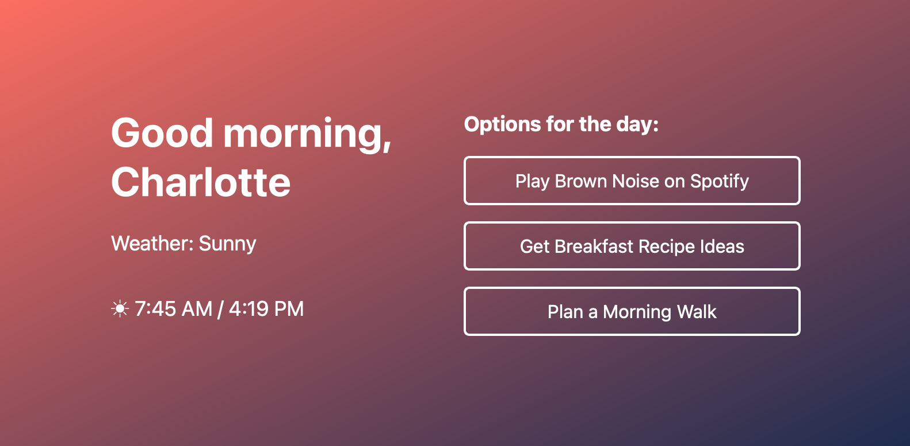

# morning routine

### original idea:

I want an app that does the following: when I first open my computer in the morning, it says "Hello Charlotte", and gives me some core facts about the day (weather, sunrise, sunset, my calendar) and offers me some options for how to start my day - brown noise on spotify, recipes for breakfast, idea for a walk.

side benefit: an excuse to learn fundamentals of app development.

### other inspiration

- [automating your digital morning with python](https://www.youtube.com/watch?v=jIf-hTf1Yf8)

### to do:

- [ ] apis
  - [ ] sunrise/sunset data
  - [ ] weather data
  - [ ] link to open spotify
  - [ ] open obsidian food note?
- [ ] link up APIs to front end
- [ ] figure out how to auto-launch at 5:30am, full screen
